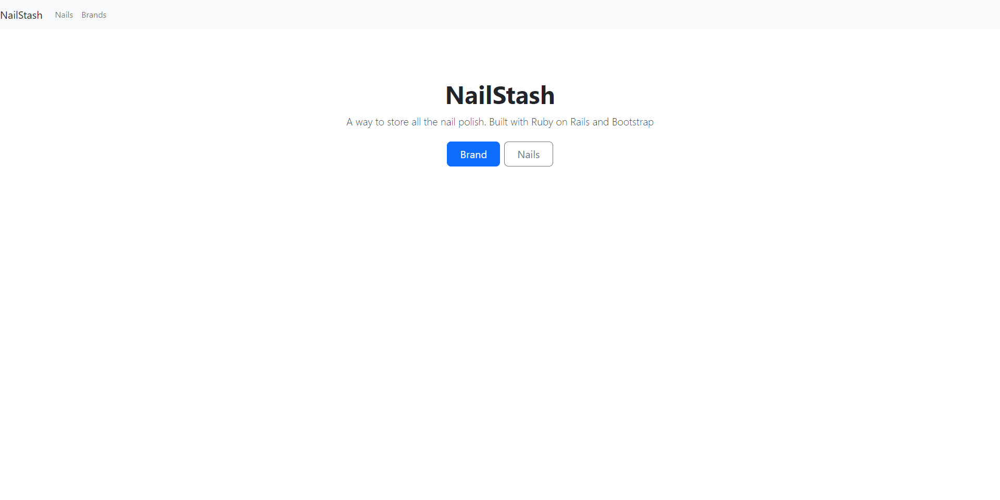
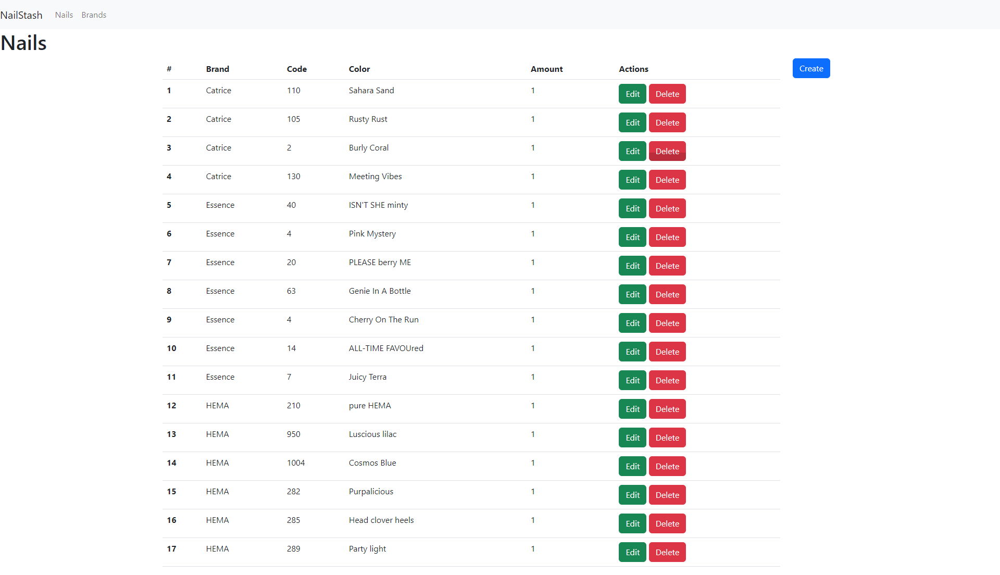
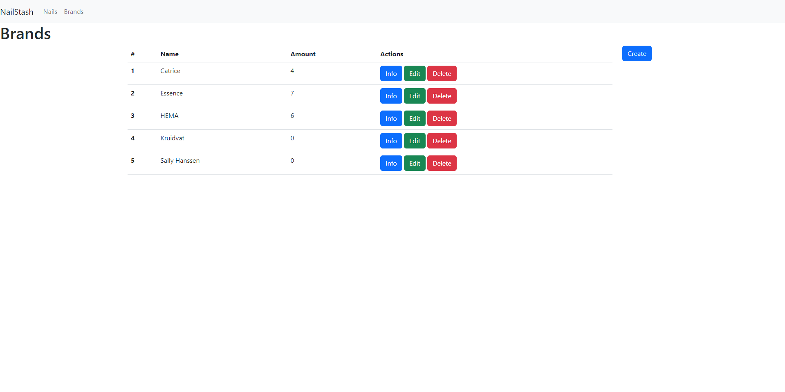

# NailStash
A web application to store all the nail polish.

## Why?
I have a lot of nail polish so I decided to make a spreadsheet for it. I came up with the idea of making a web application with Ruby on Rails so I can store it there.

I also made this project to test out Ruby on Rails. I have never used it before and wanted learn from it.

## Screenshots

